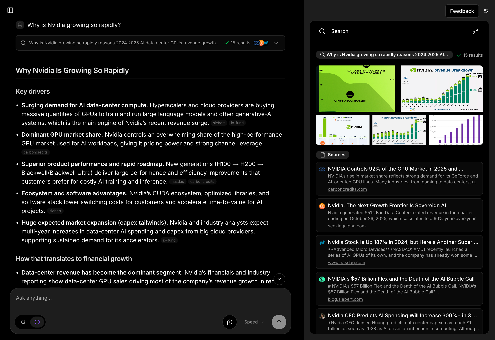

<div align="center">

# Morphic

An AI-powered search engine with a generative UI.

[![DeepWiki](https://img.shields.io/badge/DeepWiki-miurla%2Fmorphic-blue.svg?logo=data:image/png;base64,iVBORw0KGgoAAAANSUhEUgAAACwAAAAyCAYAAAAnWDnqAAAAAXNSR0IArs4c6QAAA05JREFUaEPtmUtyEzEQhtWTQyQLHNak2AB7ZnyXZMEjXMGeK/AIi+QuHrMnbChYY7MIh8g01fJoopFb0uhhEqqcbWTp06/uv1saEDv4O3n3dV60RfP947Mm9/SQc0ICFQgzfc4CYZoTPAswgSJCCUJUnAAoRHOAUOcATwbmVLWdGoH//PB8mnKqScAhsD0kYP3j/Yt5LPQe2KvcXmGvRHcDnpxfL2zOYJ1mFwrryWTz0advv1Ut4CJgf5uhDuDj5eUcAUoahrdY/56ebRWeraTjMt/00Sh3UDtjgHtQNHwcRGOC98BJEAEymycmYcWwOprTgcB6VZ5JK5TAJ+fXGLBm3FDAmn6oPPjR4rKCAoJCal2eAiQp2x0vxTPB3ALO2CRkwmDy5WohzBDwSEFKRwPbknEggCPB/imwrycgxX2NzoMCHhPkDwqYMr9tRcP5qNrMZHkVnOjRMWwLCcr8ohBVb1OMjxLwGCvjTikrsBOiA6fNyCrm8V1rP93iVPpwaE+gO0SsWmPiXB+jikdf6SizrT5qKasx5j8ABbHpFTx+vFXp9EnYQmLx02h1QTTrl6eDqxLnGjporxl3NL3agEvXdT0WmEost648sQOYAeJS9Q7bfUVoMGnjo4AZdUMQku50McDcMWcBPvr0SzbTAFDfvJqwLzgxwATnCgnp4wDl6Aa+Ax283gghmj+vj7feE2KBBRMW3FzOpLOADl0Isb5587h/U4gGvkt5v60Z1VLG8BhYjbzRwyQZemwAd6cCR5/XFWLYZRIMpX39AR0tjaGGiGzLVyhse5C9RKC6ai42ppWPKiBagOvaYk8lO7DajerabOZP46Lby5wKjw1HCRx7p9sVMOWGzb/vA1hwiWc6jm3MvQDTogQkiqIhJV0nBQBTU+3okKCFDy9WwferkHjtxib7t3xIUQtHxnIwtx4mpg26/HfwVNVDb4oI9RHmx5WGelRVlrtiw43zboCLaxv46AZeB3IlTkwouebTr1y2NjSpHz68WNFjHvupy3q8TFn3Hos2IAk4Ju5dCo8B3wP7VPr/FGaKiG+T+v+TQqIrOqMTL1VdWV1DdmcbO8KXBz6esmYWYKPwDL5b5FA1a0hwapHiom0r/cKaoqr+27/XcrS5UwSMbQAAAABJRU5ErkJggg==)](https://deepwiki.com/miurla/morphic) [](https://github.com/miurla/morphic/stargazers) [](https://github.com/miurla/morphic/network/members)

<a href="https://vercel.com/oss">
  
</a>

<br />
<br />

<a href="https://trendshift.io/repositories/9207" target="_blank"></a>



</div>

## 🗂️ Overview

- 🛠 [Features](#-features)
- 🧱 [Stack](#-stack)
- 🚀 [Quickstart](#-quickstart)
- 🌐 [Deploy](#-deploy)
- 👥 [Contributing](#-contributing)
- 📄 [License](#-license)

📝 Explore AI-generated documentation on [DeepWiki](https://deepwiki.com/miurla/morphic)

## 🛠 Features

### Core Features

- AI-powered search with GenerativeUI
- Natural language question understanding
- Multiple search providers support (Tavily, Brave, SearXNG, Exa)
- Search modes: Quick, Planning, and Adaptive
- Model type selection: Speed vs Quality
- Inspector panel for tool execution and AI processing details

### Authentication

- User authentication powered by [Supabase Auth](https://supabase.com/docs/guides/auth)

### Guest Mode

- Allow users to try the app without creating an account
- No chat history stored for guests (ephemeral sessions)
- Optional daily rate limit per IP address
- Enable with `ENABLE_GUEST_CHAT=true`

### Chat & History

- Chat history automatically stored in PostgreSQL database
- Share search results with unique URLs
- Message feedback system
- File upload support

### AI Providers

- OpenAI (Default)
- Anthropic Claude
- Google Gemini
- Vercel AI Gateway
- Ollama

Models are configured in `config/models/*.json` with profile-based settings. When using non-OpenAI providers, update the model configuration files with compatible model IDs. See [Configuration Guide](docs/CONFIGURATION.md) for details.

### Search Capabilities

- URL-specific search
- Content extraction with Tavily or Jina
- Citation tracking and display
- Self-hosted search with SearXNG support

### Additional Features

- Docker deployment ready
- Browser search engine integration
- LLM observability with Langfuse (optional)
- Todo tracking for complex tasks

## 🧱 Stack

### Core Framework

- [Next.js](https://nextjs.org/) - React framework with App Router
- [TypeScript](https://www.typescriptlang.org/) - Type-safe development
- [Vercel AI SDK](https://ai-sdk.dev) - TypeScript toolkit for building AI-powered applications

### Authentication & Authorization

- [Supabase](https://supabase.com/) - User authentication and backend services

### AI & Search

- [OpenAI](https://openai.com/) - Default AI provider (Optional: Google AI, Anthropic)
- [Tavily AI](https://tavily.com/) - AI-optimized search with context
- [Brave Search](https://brave.com/search/api/) - Traditional web search results
- Tavily alternatives:
  - [SearXNG](https://docs.searxng.org/) - Self-hosted search
  - [Exa](https://exa.ai/) - Meaning-based search powered by embeddings
  - [Firecrawl](https://firecrawl.dev/) - Web, news, and image search with crawling, scraping, LLM-ready extraction, and [open source](https://github.com/firecrawl/firecrawl).

### Data Storage

- [PostgreSQL](https://www.postgresql.org/) - Primary database (supports Neon, Supabase, or standard PostgreSQL)
- [Drizzle ORM](https://orm.drizzle.team/) - Type-safe database ORM
- [Cloudflare R2](https://developers.cloudflare.com/r2/) - File storage (optional)

### UI & Styling

- [Tailwind CSS](https://tailwindcss.com/) - Utility-first CSS framework
- [shadcn/ui](https://ui.shadcn.com/) - Re-usable components
- [Radix UI](https://www.radix-ui.com/) - Unstyled, accessible components
- [Lucide Icons](https://lucide.dev/) - Beautiful & consistent icons

## 🚀 Quickstart

### 1. Fork and Clone repo

Fork the repo to your Github account, then run the following command to clone the repo:

```bash
git clone git@github.com:[YOUR_GITHUB_ACCOUNT]/morphic.git
```

### 2. Install dependencies

```bash
cd morphic
bun install
```

### 3. Configure environment variables

```bash
cp .env.local.example .env.local
```

Fill in the required environment variables in `.env.local`:

```bash
OPENAI_API_KEY=your_openai_key
TAVILY_API_KEY=your_tavily_key
```

### 4. Run app locally

```bash
bun dev
```

Visit http://localhost:3000 in your browser.

**Note**: By default, Morphic runs without a database or authentication. To enable chat history, authentication, and other features, see [CONFIGURATION.md](./docs/CONFIGURATION.md). For Docker setup, see the [Docker Guide](./docs/DOCKER.md).

## 🌐 Deploy

Host your own live version of Morphic with Vercel or Docker.

### Vercel

[](https://vercel.com/new/clone?repository-url=https%3A%2F%2Fgithub.com%2Fmiurla%2Fmorphic&env=DATABASE_URL,OPENAI_API_KEY,TAVILY_API_KEY,BRAVE_SEARCH_API_KEY)

**Note**: For Vercel deployments, set `ENABLE_AUTH=true` and configure Supabase authentication to secure your deployment.

### Docker

See the [Docker Guide](./docs/DOCKER.md) for prebuilt images, Docker Compose setup, and deployment instructions.

## 👥 Contributing

We welcome contributions to Morphic! Whether it's bug reports, feature requests, or pull requests, all contributions are appreciated.

Please see our [Contributing Guide](CONTRIBUTING.md) for details on:

- How to submit issues
- How to submit pull requests
- Commit message conventions
- Development setup

## 📄 License

This project is licensed under the Apache License 2.0 - see the [LICENSE](LICENSE) file for details.
